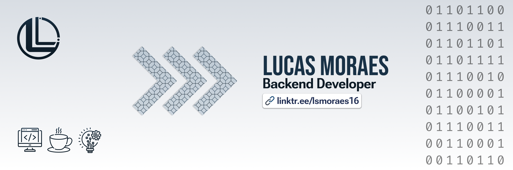

## Contact info

  

## About me

Coloque aqui algo sobre você :)

### Goals

Coloque suas metas <3

## Statistics

   
  
  

 

## My stacks

#### Studying:
&nbsp;
&nbsp;

#### Backend:

&nbsp;
&nbsp;

#### Frontend:

&nbsp;

#### Databases:
&nbsp;
&nbsp;
&nbsp;

&nbsp;
&nbsp;

